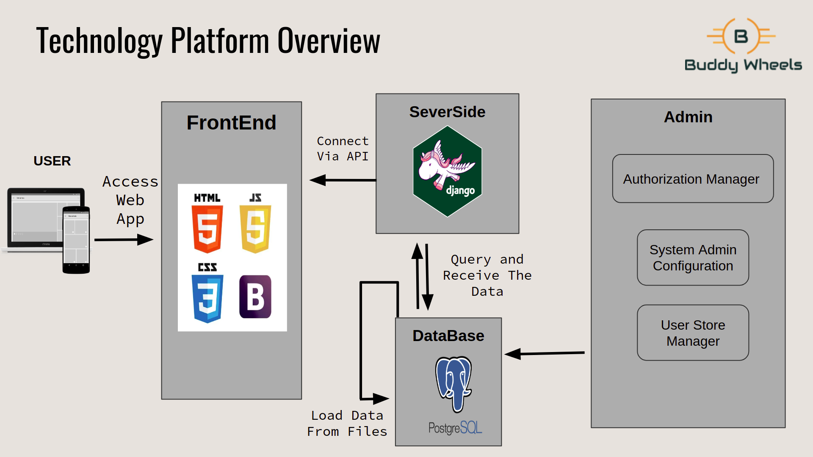
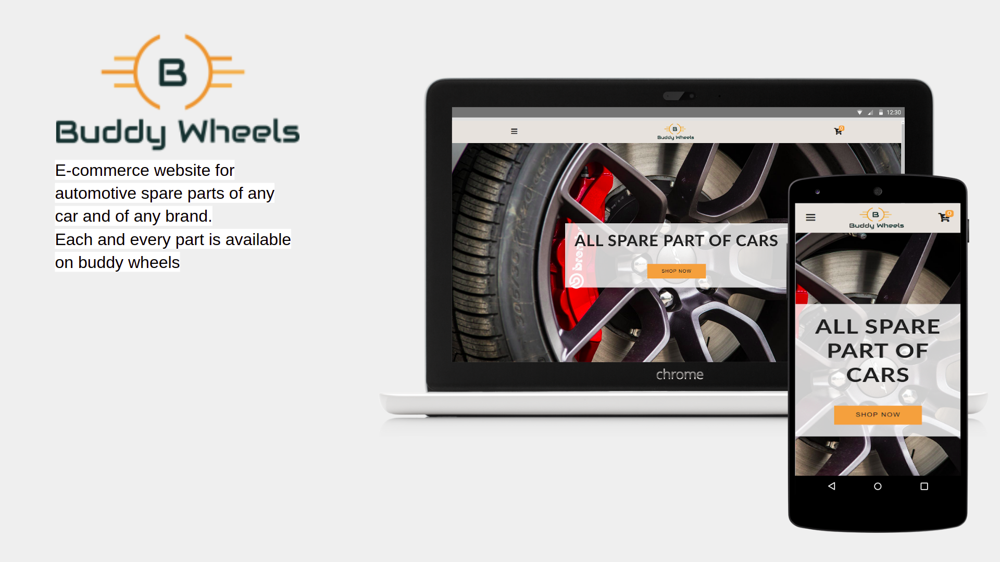
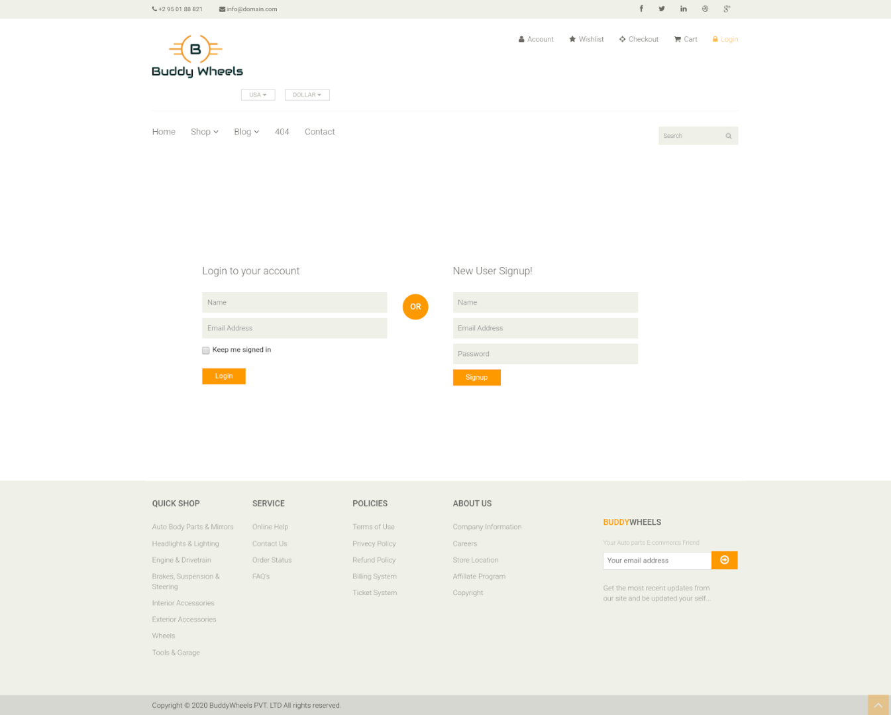
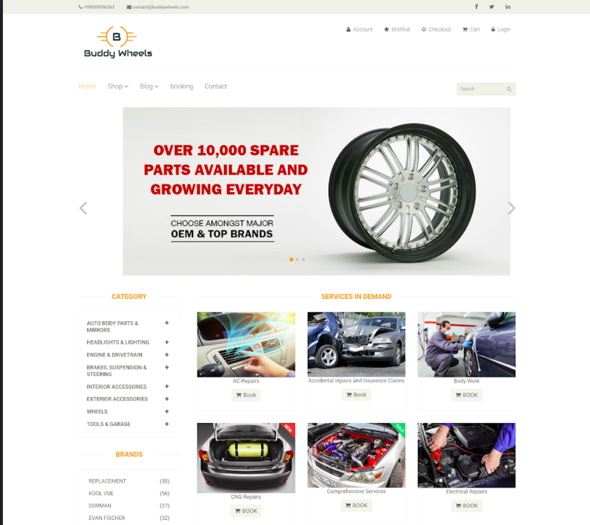
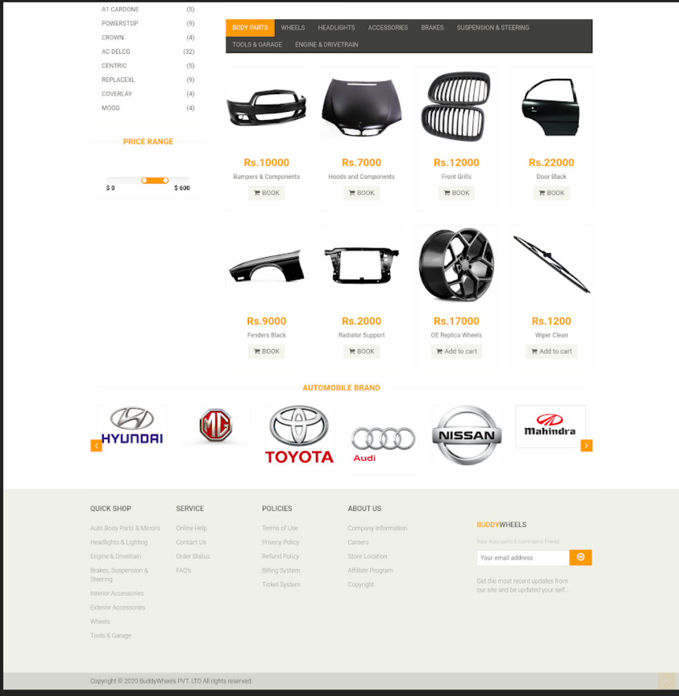
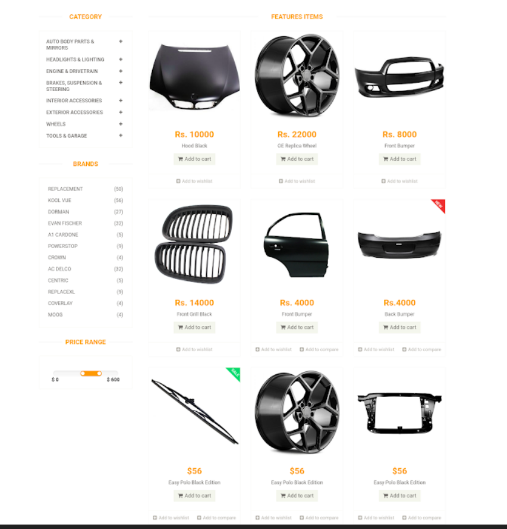
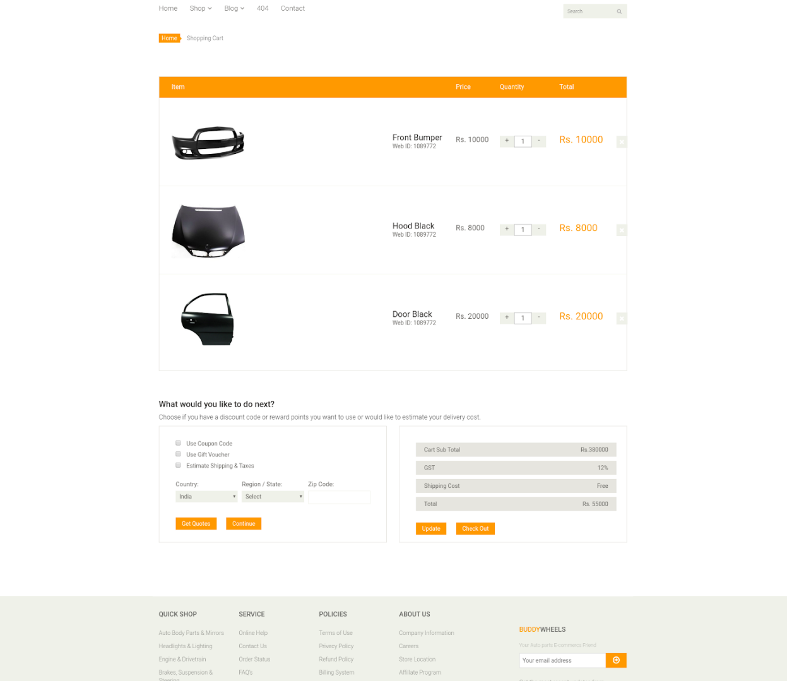
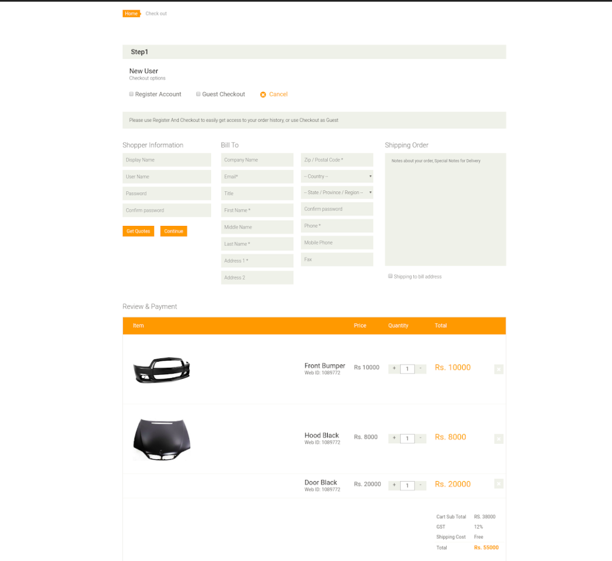

### AN E-COMMERCE FOR SPARE PARTS FOR CARS

Buddy Wheels aims to provide the customers a directly buy goods, services etc. from a seller interactively in real-time without any intermediary service over the internet. Online shopping is the process of buying goods and services from merchants who sell on the internet. Customers can visit web stores from the comfort of their homes and shop as they sit in front of the computer. Customers can buy a variety of automotive spare part from online store.

## Objectives

The main objective of this project is to design a dynamic, responsive E-commerce website.

- This project aims at developing a highly cost-effective E-commerce
  website for automotive spare parts of any car and of any brand.

- The Project aim is to stop Duplicity in market and provide genuine
  products.

- The main objective of this project is to design a dynamic, responsive
  E-commerce website. An Auto spare parts selling website with the
  use trending technologies in market with maximum functionality,
  efficiency.

- Customers can easily search products and make their own carts
  and can pay online, as we provide secure online transactions.

- Data Security is maintained to a relatively high level by
  implementing it at the Database level, so as to ensure that only
  admin have access to confidential client information.

#### Simple Interface

A very user-friendly interface in which user can easily find, search, explore the products.

#### Security

Data Security is maintained to a relatively high level by implementing it at the Database
level.

#### Economic

As compared to previous system, this application needs to be economic.

#### No Special Skills

Many previous systems need a technical person who can run the system. But this project can
be run by a layman.

#### Inventory Management

Control your inventory efficiently is one of the main objectives of this system.

#### Minimize the Hardware requirements:

You don’t need any specialized hardware to access the website. User can access through any
computer.

## Proposed System along with advantages

In, our system we have many features such as we provide OEM (Original Equipment Manu-
facturer) means the parts are from the car manufacturer, not by any third party. User can eas-
ily search products and add them to the cart and make transactions through various methods.

#### Advantages over other systems are:

- We provide various payment method to customers i.e. Customers can also opt for
  COD method or through online transactions.

- User can find any products without facing any problem.

- User can also opt for fast delivery as we can also provide fast delivery for the products.

# Screens :computer:

## Scope of the projects

- This project is mainly for small and micro garage company.
- This help the customer to find good garage nearby
- Customer easily select product/part and buy it.
- Add them to shopping cart for future reference.
  Services in demand feature.
